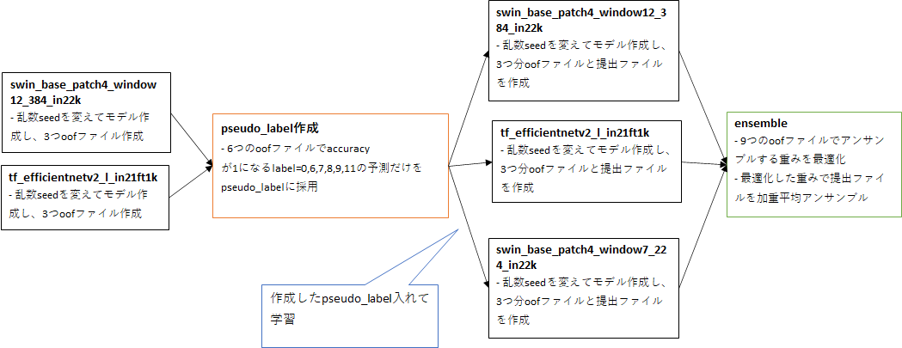

# ProbSpace 宗教画テーマの分類 Private 1st solution

https://prob.space/competitions/religious_art


## 解法の概要




## ディレクトリ構成と各notebookの概要
```bash
|-code         # 学習で使うcutmixのコード
|-Git          # 学習で使うOptimizerのコード 
|-notebook
 |-eda      
  |-eda.ipynb  # データ可視化+npzファイルをjpgファイルに変換
 |-first       # pseudo_label作成用フォルダ
  |-ex11_colab 
   |-ex11_train-checkpoint.ipynb                  # swin_base_patch4_window12_384_in22kの学習
   |-ex11_cv_influence-checkpoint.ipynb           # oofファイル作成
   |-ex11_test_influence-checkpoint.ipynb         # 提出ファイル作成
  |-ex16_colab 
   |-ex16_train-checkpoint.ipynb                  # tf_efficientnetv2_l_in21ft1kの学習
   |-ex16_cv_influence-checkpoint.ipynb           # oofファイル作成
   |-ex16_test_influence-checkpoint.ipynb         # 提出ファイル作成
  |-make_pseudo_label
   |-ex11_ex16_big_logit_test-checkpoint.ipynb    # pseudo_label作成
   |-inf_cv                                       # ex11_colab, ex16_colabで作成したoofファイル
   |-inf_test                                     # ex11_colab, ex16_colabで作成した提出ファイル
 |-second      # 加重平均アンサンブル用フォルダ
  |-ex11_pseudo3_colab 
   |-ex11_pseudo3_train-checkpoint.ipynb          # swin_base_patch4_window12_384_in22kの学習
   |-ex11_pseudo3_cv_influence-checkpoint.ipynb   # oofファイル作成
   |-ex11_pseudo3_test_influence-checkpoint.ipynb # 提出ファイル作成
  |-ex15_pseudo3
   |-ex15_pseudo3_train-checkpoint.ipynb          # swin_base_patch4_window7_224_in22kの学習
   |-ex15_pseudo3_cv_influence-checkpoint.ipynb   # oofファイル作成
   |-ex15_pseudo3_test_influence-checkpoint.ipynb # 提出ファイル作成
  |-ex16_pseudo3_colab 
   |-ex16_pseudo3_train-checkpoint.ipynb          # tf_efficientnetv2_l_in21ft1kの学習
   |-ex16_pseudo3_cv_influence-checkpoint.ipynb   # oofファイル作成
   |-ex16_pseudo3_test_influence-checkpoint.ipynb # 提出ファイル作成
  |-ensemble
   |-ex11_ex15_ex16_pseudo3_votingclassifier-fit_v2-checkpoint.ipynb            # 加重平均アンサンブル実行
   |-ex11_ex15_ex16_pseudo3_votingclassifier-fit_v2_ens_weights_submission.csv  # 最終提出ファイル
   |-inf_cv    # ex11_pseudo3_colab, ex15_pseudo3, ex16_pseudo3_colabで作成したoofファイル
   |-inf_test  # ex11_pseudo3_colab, ex15_pseudo3, ex16_pseudo3_colabで作成した提出ファイル
```


## 実行手順

1. notebook/eda/eda.ipynb を実行してnpzファイルをjpgファイルに変換
2. notebook/first のex11_colab, ex16_colab のnotebookを実行
3. 2の出力ファイルをnotebook/first/make_pseudo_label のinf_cv, inf_test にコピー
4. notebook/first/make_pseudo_label のnotebookを実行
5. notebook/second のex11_pseudo3_colab, ex15_pseudo3, ex16_pseudo3_colab のnotebookを実行
6. 5の出力ファイルをnotebook/second/ensemble のinf_cv, inf_test にコピー
7. notebook/second/ensemble のnotebookを実行して、ex11_ex15_ex16_pseudo3_votingclassifier-fit_v2_ens_weights_submission.csvを出力
